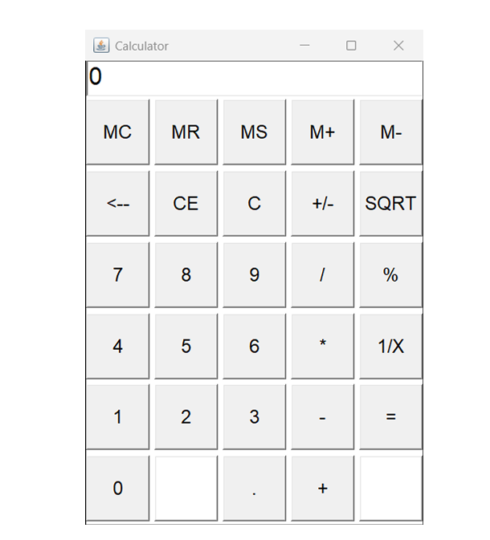

# 🧮 Java AWT Calculator

A desktop calculator application built using Java's Abstract Window Toolkit (AWT). It provides a simple graphical user interface for performing basic arithmetic operations.

## 🚀 Features

- Basic arithmetic operations (+, -, ×, ÷)
- Square root
- Reciprocal (1/x)
- Percentage calculation
- Toggle sign (+/-)
- Memory operations (MC, MR, MS, M+, M-)
- Backspace and clear functionalities

## 🛠️ Technologies Used

- Java
- AWT (Abstract Window Toolkit)

## 🖼️ Screenshot



## 📂 How to Run

1. Clone the repository:

```bash
git clone https://github.com/thejunox/AWT-Calculator.git
cd AWT-Calculator

```
2.Compile and run:
```
javac Calculator.java
java Calculator
```

📄 License
This project is licensed under the MIT License.

🔗 Connect with me:

Email: junoxnujan@gmail.com

GitHub: @thejunox
